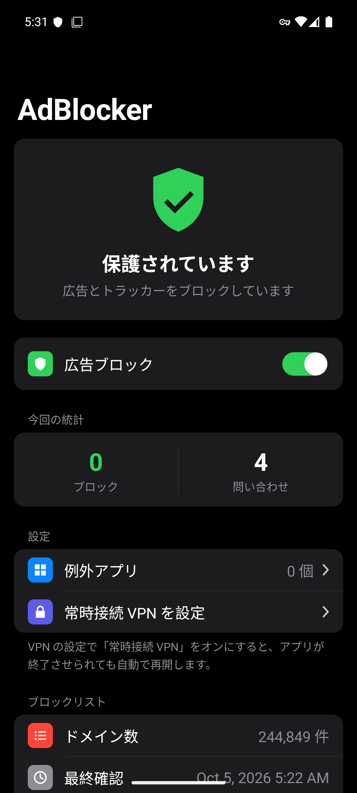
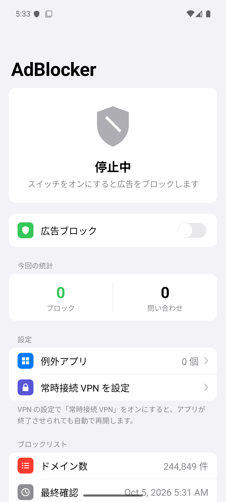
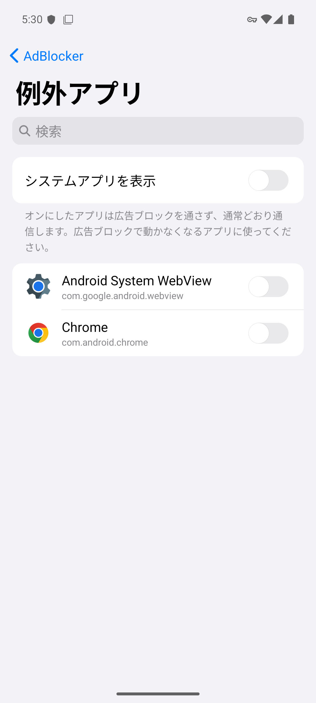

# AdBlocker

[English](README.md) | **日本語**

Android 用の広告ブロッカーです。端末内にローカル VPN を作り、広告・トラッカーのドメインへの DNS 問い合わせを止めます。root は不要で、通信内容を外部に送ることもありません。

> **このリポジトリのコード・ドキュメント・アイコンは、[Claude Code](https://claude.com/claude-code) (Anthropic の AI コーディングツール) が作成しました。**

<p>
  
  
  
</p>

## ダウンロード

[Releases](https://github.com/tonbo2339/AdBlocker/releases/latest) から `AdBlocker-vX.Y.apk` をダウンロードしてインストールしてください (「提供元不明のアプリ」の許可が必要です)。
一度入れれば、以降はアプリが新しいバージョンを確認して自動で更新します。

- 動作環境: Android 8.0 以上
- まだ開発中のため、バージョンは 0.x です

## 機能

- **広告ブロック**: 約 24 万の広告・トラッカーのドメインへの接続を止める
- **例外アプリ**: 選んだアプリは広告ブロックを通らず、普段どおり通信する (広告ブロックで動かなくなるアプリ用)
- **ブロックリストの自動更新**: 1 日 1 回、最新のリストを取得する
- **アプリの自動更新**: 1 日 1 回 GitHub Releases を確認し、新しいバージョンがあれば自動でインストール (設定で「通知のみ」にもできる)
- **Wi-Fi のときだけ更新**: 自動更新 (ブロックリスト・アプリ) をモバイル通信では行わないようにできる
- **クイック設定タイル**: 通知パネルから ON / OFF
- **通知の設定**: アプリの更新・ブロックリストの更新・動作中の表示を、それぞれオン / オフできる
- 端末の再起動後・アプリの更新後に自動で再開、常時接続 VPN にも対応
- ライト / ダークモード対応
- 日本語 / 英語 (端末の言語に合わせる。Android 13 以上は設定でアプリごとに切り替え可)

## 制限

- Android では VPN は同時に 1 つしか使えない。他の VPN アプリを起動すると AdBlocker は自動で OFF になる
- 設定の「プライベート DNS」が「ホスト名を指定」だとブロックが効かない (「自動」か「オフ」にする)
- 広告があった場所の**空白は消せない** (DNS では通信を止めるだけで、画面のレイアウトは変えられないため)。ブラウザなら Firefox + uBlock Origin などを併用する
- 本編と同じドメインから配信される広告 (YouTube の動画広告など)、IP アドレス直指定やアプリ独自の DNS-over-HTTPS は止められない
- 大きな応答で TCP にフォールバックする DNS 問い合わせ (まれ) には対応していない

## ブロックリスト

| 取得元 | ライセンス |
|---|---|
| [StevenBlack/hosts](https://github.com/StevenBlack/hosts) | MIT |
| [AdGuard DNS filter](https://github.com/AdguardTeam/AdGuardSDNSFilter) | GPL-3.0 |

- 1 日 1 回 (と画面の「今すぐ更新」) で取得。ETag で変更が無ければダウンロードしない
- 取得元ごとに保存し、取得できなくなった取得元は前回の内容を使い続ける。ルールが 1,000 件未満なら異常とみなして使わない
- 例外ルール (`@@||domain^`) も反映する
- 初回のダウンロードまでは、アプリに同梱した StevenBlack のリスト (`app/src/main/assets/blocklist.txt`) を使う

同梱リストを作り直すとき:

```
curl -sSL https://raw.githubusercontent.com/StevenBlack/hosts/master/hosts \
  | tr -d '\r' | awk '$1=="0.0.0.0" && $2!="0.0.0.0" {print tolower($2)}' | sort -u \
  > app/src/main/assets/blocklist.txt
```

## ビルド

Android Studio でこのフォルダを開いて実行します。コマンドラインなら:

```
gradlew assembleDebug          # app/build/outputs/apk/debug/app-debug.apk
gradlew testDebugUnitTest      # 単体テスト (パケット / DNS / ルール解析 / バージョン比較)
gradlew lintDebug
```

### リリースと自動更新

アプリは `https://api.github.com/repos/tonbo2339/AdBlocker/releases/latest` を見て、タグ (`v0.1` など) が自分の `versionName` より新しければ、添付の `.apk` をダウンロードしてインストールします。

1. `app/build.gradle.kts` の `versionCode` を上げ、`versionName` を新しい番号にする
2. ビルドして、タグ `v<versionName>` のリリースに APK を添付する

インストール前に、パッケージ名・バージョンが上がっていること・署名が今のアプリと同じことを確かめます。
Android 12 以上では、2 回目以降の更新は確認なしで入ります (初回は確認画面が出ます)。

### 署名

Releases の APK は作者の PC のデバッグ鍵で署名しています。上書き更新は同じ鍵で署名した APK でしかできないため、自分でビルドした APK を入れた場合、Releases からの自動更新はできません (いったんアンインストールが必要)。

## ファイル構成

| ファイル | 内容 |
|---|---|
| `AdBlockVpnService.kt` | VPN 本体 (tun の読み書き、ブロック判定、上流 DNS への転送) |
| `Packets.kt` / `Dns.kt` | IPv4 / IPv6 + UDP パケット、DNS メッセージの解析と組み立て |
| `BlockList.kt` / `DomainSet.kt` | ブロックリストの読み込みと照合 (親ドメイン・例外ルール対応) |
| `RuleParser.kt` | hosts / ドメイン / Adblock 形式の 1 行を解釈 |
| `BlockListUpdater.kt` / `BlockListWorker.kt` | ブロックリストのダウンロードと 1 日 1 回の自動更新 |
| `UpstreamDns.kt` | 転送先 DNS の選択 (回線の DNS を優先、公開 DNS は予備) |
| `AppUpdater.kt` / `AppUpdateWorker.kt` / `InstallResultReceiver.kt` | GitHub Releases からの自動更新 |
| `MainActivity.kt` / `AppListActivity.kt` | メイン画面 / 例外アプリの選択画面 |
| `CardLayout.kt` | 角丸カード (iOS の設定画面風のセクション) |
| `AdBlockTileService.kt` | クイック設定タイル |
| `BootReceiver.kt` | 再起動後・更新後の自動再開 |
| `Notifications.kt` / `Prefs.kt` | 通知 / 設定の保存 |

## ライセンス

[MIT License](LICENSE)。ブロックリストはそれぞれの元のライセンスに従います ([NOTICE](NOTICE) を参照)。
