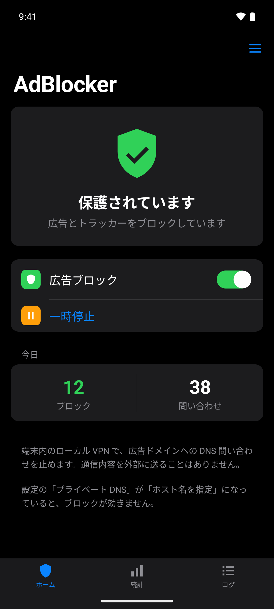
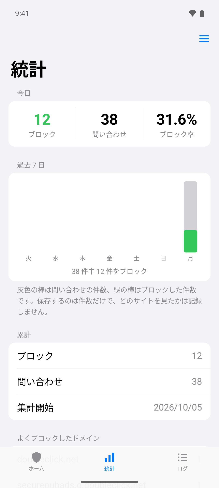
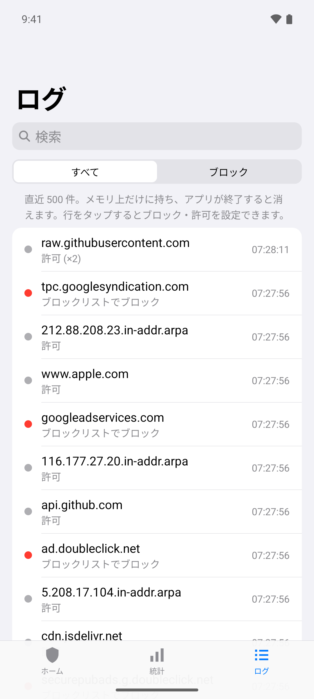

# AdBlocker

[English](README.md) | **日本語**

Android 用の広告ブロッカーです。端末内にローカル VPN を作り、広告・トラッカーのドメインへの DNS 問い合わせを止めます。root は不要で、通信内容を外部に送ることもありません。

> **このリポジトリのコード・ドキュメント・アイコンは、[Claude Code](https://claude.com/claude-code) (Anthropic の AI コーディングツール) が作成しました。**

<p>
  
  
  
</p>

## ダウンロード

[Releases](https://github.com/tonbo2339/AdBlocker/releases/latest) から `AdBlocker-vX.Y.apk` をダウンロードしてインストールしてください (「提供元不明のアプリ」の許可が必要です)。
一度入れれば、以降はアプリが新しいバージョンを確認して自動で更新します。

- 動作環境: Android 8.0 以上
- まだ開発中のため、バージョンは 0.x です

## 機能

- **広告ブロック**: 約 24 万の広告・トラッカーのドメインへの接続を止める
- **CNAME 隠しの検出**: サイト自身のサブドメインに見せかけたトラッカーも止める (CNAME の転送先がブロック対象のとき)
- **DNS を自分で指定するアプリもブロック** (任意): 8.8.8.8 や 1.1.1.1 などの公開 DNS へ直接送られる問い合わせも判定し、それらへの暗号化した問い合わせ (DNS over HTTPS / TLS) は断って端末の DNS を使わせる
- **速い名前解決**: 答えを有効期間 (TTL) の間だけ覚えておく。遅い DNS サーバーがあれば、ほかのサーバーにも同時に問い合わせる。失敗したときは、アプリをタイムアウトまで待たせずにすぐ知らせる
- **ブロックリストの選択**: 組み込みのリストをオン / オフできるほか、好きなリストを URL で追加できる
- **例外アプリ**: 選んだアプリは広告ブロックを通らず、普段どおり通信する (広告ブロックで動かなくなるアプリ用)
- **ブロック・許可するドメイン**: ドメインを手動でブロック・許可できる (サブドメインにも効く。許可が優先)。`*` で何にでも当たる書き方 (`ads.*`、`*tracker*`) や、IP アドレス・範囲 (`203.0.113.0/24`) のブロック (答えがそのアドレスになる名前を止める) もできる
- **一時停止**: VPN を止めずに、5 分・15 分・1 時間だけブロックを止める。一時停止中は、通知に再開の時刻と「再開」ボタンが出る
- **問い合わせのログ**: 直近 500 件と、どのアプリの問い合わせか (Android 10 以上)、ブロックしたかどうか。ドメインやアプリの名前で検索でき、タップするとブロック・許可を設定できる。既定はメモリ上だけ。1 日・7 日・30 日分を端末のファイルに残して CSV で書き出すこともできる (オフにする・期間を短くするときは、保存したログを消す前に確認する)。オフにもできる
- **統計**: 今日の件数、過去 7 日のグラフ、累計、よくブロックしたドメイン・アプリ。保存するのは件数だけで、どのサイトを見たかは残さない
- **プライベート DNS の警告**: 「プライベート DNS」が「ホスト名を指定」でブロックが効かないときに知らせる
- **暗号化 DNS** (任意): 問い合わせを DNS over TLS で Cloudflare・Google・Quad9 に送る
- **設定のバックアップ**: ブロック・許可するドメイン・例外アプリ・設定をファイルに書き出し、機種変更後の端末で読み込める
- **ブロックリストの自動更新**: 1 日 1 回、最新のリストを取得する (時刻を選べる)
- **アプリの自動更新**: 1 日 1 回 GitHub Releases を確認し、新しいバージョンがあれば自動でアップデート (設定で「通知のみ」にもできる)
- **Wi-Fi のときだけ自動更新**: 自動更新 (ブロックリスト・アプリ) をモバイル通信では行わない (既定でオン)
- **クイック設定タイル**: 通知パネルから ON / OFF (一時停止中にタップすると再開)
- **ランチャーのショートカット**: アプリのアイコンを長押しすると「一時停止 / 再開」「オン / オフ」が使える
- **通知の設定**: アプリの更新・ブロックリストの更新・動作中の表示を、それぞれオン / オフできる
- 端末の再起動後・アプリの更新後に自動で再開、常時接続 VPN にも対応
- ライト / ダークモード対応
- 日本語 / 英語 (端末の言語に合わせる。Android 13 以上は設定でアプリごとに切り替え可)

## 制限

- Android では VPN は同時に 1 つしか使えない。他の VPN アプリを起動すると AdBlocker は自動で OFF になる
- 設定の「プライベート DNS」が「ホスト名を指定」だとブロックが効かない (「自動」か「オフ」にする)。そのときはアプリが警告を出す
- 広告があった場所の**空白は消せない** (DNS では通信を止めるだけで、画面のレイアウトは変えられないため)。ブラウザなら Firefox + uBlock Origin などを併用する
- 本編と同じドメインから配信される広告 (YouTube の動画広告など)、IP アドレス直指定や、主な公開 DNS 以外へのアプリ独自の DNS-over-HTTPS は止められない
- ドメイン名で止める方式なので、ブロックした広告の跡 (空いた枠、画像が読めない印の ×、「閉じる」ボタンなど) はページに残ることがある。跡まで消すには、ブラウザーの中で動く広告ブロッカー (Firefox と uBlock Origin など) が必要
- 大きな応答で TCP にフォールバックする DNS 問い合わせ (まれ) には対応していない

## ブロックリスト

| 取得元 | ライセンス |
|---|---|
| [StevenBlack/hosts](https://github.com/StevenBlack/hosts) | MIT |
| [AdGuard DNS filter](https://github.com/AdguardTeam/AdGuardSDNSFilter) | GPL-3.0 |
| [HaGeZi Multi NORMAL](https://github.com/hagezi/dns-blocklists) (既定はオフ) | GPL-3.0 |

- 設定 → ブロックリスト でオン / オフでき、自分で選んだリスト (hosts・ドメイン・Adblock 形式) を https の URL で追加できる
- 1 日 1 回 (と画面の「今すぐ更新」) で取得。ETag で変更が無ければダウンロードしない
- 取得元ごとに保存し、取得できなくなった取得元は前回の内容を使い続ける。組み込みのリストはルールが 1,000 件未満なら異常とみなして使わない
- 例外ルール (`@@||domain^`) も反映する
- 初回のダウンロードまでは、アプリに同梱した StevenBlack のリスト (`app/src/main/assets/blocklist.txt`) を使う (StevenBlack がオンのときだけ)

同梱リストを作り直すとき:

```
curl -sSL https://raw.githubusercontent.com/StevenBlack/hosts/master/hosts \
  | tr -d '\r' | awk '$1=="0.0.0.0" && $2!="0.0.0.0" {print tolower($2)}' | sort -u \
  > app/src/main/assets/blocklist.txt
```

## ビルド

Android Studio でこのフォルダを開いて実行します。コマンドラインなら:

```
gradlew assembleDebug          # app/build/outputs/apk/debug/app-debug.apk
gradlew assembleRelease        # app/build/outputs/apk/release/app-release.apk
gradlew testDebugUnitTest      # 単体テスト (パケット / DNS / ルール解析 / バージョン比較 / ブロック・許可するドメイン / ブロックリストの取得元 / DNS キャッシュ / 自動更新の時刻)
gradlew lintDebug
```

### リリースと自動更新

アプリは `https://api.github.com/repos/tonbo2339/AdBlocker/releases/latest` を見て、タグ (`v0.1` など) が自分の `versionName` より新しければ、添付の `.apk` をダウンロードしてインストールします。

1. `app/build.gradle.kts` の `versionCode` を上げ、`versionName` を新しい番号にする
2. ビルドして、タグ `v<versionName>` のリリースに APK を添付する

インストール前に、パッケージ名・バージョンが上がっていること・署名が今のアプリと同じことを確かめます。
Android 12 以上では、2 回目以降の更新は確認なしで入ります (初回は確認画面が出ます)。

## ファイル構成

| ファイル | 内容 |
|---|---|
| `AdBlockVpnService.kt` | VPN 本体 (tun の読み書き、ブロック判定、上流 DNS への転送) |
| `Packets.kt` / `Dns.kt` / `DnsCache.kt` | IPv4 / IPv6 パケット、DNS メッセージの解析と組み立て / 答えのキャッシュ |
| `BlockList.kt` / `DomainSet.kt` | ブロックリストの読み込みと照合 (親ドメイン・例外ルール対応) |
| `RuleParser.kt` | hosts / ドメイン / Adblock 形式の 1 行を解釈 |
| `BlockListUpdater.kt` / `BlockListWorker.kt` / `UpdateConstraints.kt` | ブロックリストのダウンロード、1 日 1 回の自動更新と、その時刻・回線の条件 |
| `UpstreamDns.kt` | 転送先 DNS の選択 (回線の DNS を優先、公開 DNS は予備) と、主な公開 DNS の一覧 |
| `DotClient.kt` | 暗号化 DNS (DNS over TLS) |
| `AppUpdater.kt` / `AppUpdateWorker.kt` / `InstallResultReceiver.kt` | GitHub Releases からの自動更新 |
| `Filter.kt` / `UserRules.kt` / `Pause.kt` | 問い合わせごとの判定 (一時停止・ブロック・許可するドメイン・ブロックリスト) |
| `QueryLog.kt` / `QueryLogFiles.kt` / `QueryOwners.kt` / `StatsStore.kt` | 問い合わせのログ (メモリ上) / ファイルへの保存 / 問い合わせたアプリの判別 / 日ごとの件数 |
| `PrivateDnsMonitor.kt` | 「プライベート DNS」が「ホスト名を指定」かの検知 |
| `MainActivity.kt` / `LogAdapter.kt` | ホーム / 統計 / ログのタブ |
| `SettingsActivity.kt` / `SettingsPages.kt` / `SettingsBuilder.kt` | 設定 (トップ、DNS・ログ・アップデート・通知・バックアップの各ページ、共通の部品) |
| `RulesActivity.kt` / `BlocklistsActivity.kt` / `AppListActivity.kt` | ブロック・許可するドメイン / ブロックリスト / 例外アプリ |
| `SettingsBackup.kt` | 設定の書き出しと読み込み |
| `ShortcutActivity.kt` / `ResumeReceiver.kt` | ランチャーのショートカット / 通知の「再開」ボタン |
| `DomainActions.kt` | ドメインのブロック・許可のメニュー |
| `CardLayout.kt` / `BarChartView.kt` | 角丸カード / 過去 7 日のグラフ |
| `AdBlockTileService.kt` | クイック設定タイル |
| `BootReceiver.kt` | 再起動後・更新後の自動再開 |
| `Notifications.kt` / `Prefs.kt` | 通知 / 設定の保存 |

## ライセンス

[MIT License](LICENSE)。ブロックリストはそれぞれの元のライセンスに従います ([NOTICE](NOTICE) を参照)。
