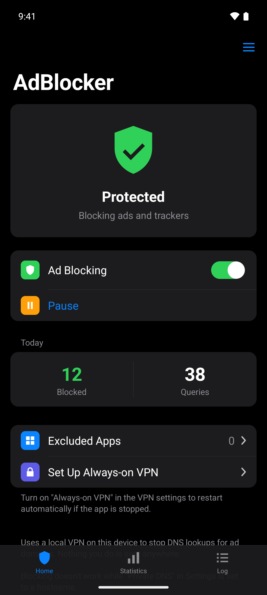
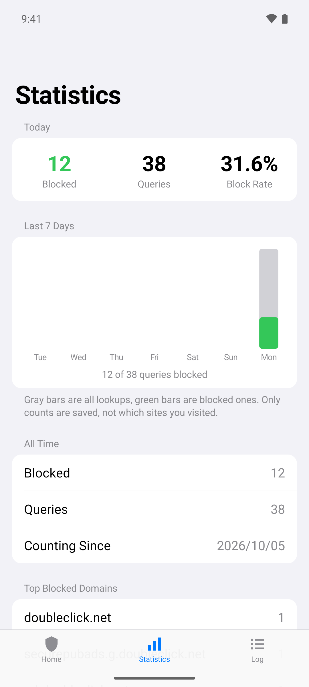
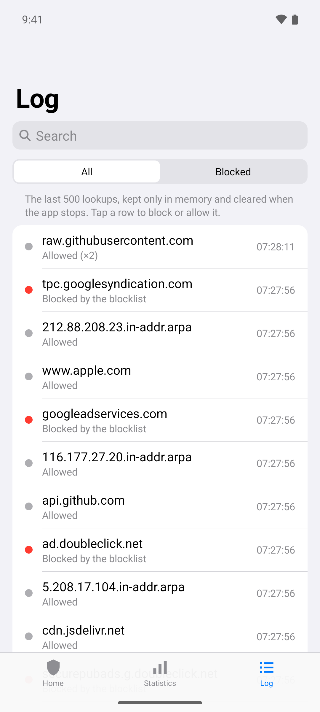

# AdBlocker

**English** | [日本語](README.ja.md)

An ad blocker for Android. It runs a local VPN on the device and stops DNS lookups for ad and tracker domains. No root required, and nothing you do is sent anywhere.

> **The code, documentation and icon in this repository were made by [Claude Code](https://claude.com/claude-code) (Anthropic's AI coding tool).**

<p>
  
  
  
</p>

## Download

Download `AdBlocker-vX.Y.apk` from [Releases](https://github.com/tonbo2339/AdBlocker/releases/latest) and install it (you need to allow installing unknown apps).
After that, the app checks for new versions and updates itself.

- Requires Android 8.0 or later
- Still in development, so the version is 0.x

## Features

- **Ad blocking**: blocks connections to about 360,000 ad and tracker domains (StevenBlack, AdGuard DNS filter and HaGeZi Pro)
- **CNAME cloaking detection**: also blocks trackers disguised as a site's own subdomain (when the CNAME target is on the blocklist)
- **Apps that use their own DNS** (optional): lookups sent straight to public DNS servers such as 8.8.8.8 or 1.1.1.1 are filtered too, and encrypted DNS to them (DNS over HTTPS / TLS) is refused so the app falls back to the phone's DNS
- **Fast lookups**: answers are cached for their TTL, several DNS servers are asked in parallel when one is slow, and a failure is reported right away instead of making apps wait for a timeout
- **Choose blocklists**: turn the built-in lists on / off, or add any list by URL
- **Excluded apps**: chosen apps bypass ad blocking and connect as usual (for apps that break with ad blocking)
- **Block & allow domains**: block or allow domains yourself (a rule covers the domain and its subdomains; allow rules win). Use `*` as a wildcard (`ads.*`, `*tracker*`), or block an IP address or range (`203.0.113.0/24`) to stop any name whose answer is that address
- **Pause**: let everything through for 5 minutes, 15 minutes or 1 hour without turning the VPN off. The notification shows when it resumes and has a Resume button
- **Query log**: the last 500 lookups, which app made each one (Android 10+), and whether it was blocked. Search by domain or app name, and tap one to block or allow it. Kept only in memory by default; you can also keep it in a file on the phone for 1, 7 or 30 days and export it as CSV (turning the log off or shortening the period asks before deleting the saved log). Can be turned off
- **Statistics**: today's counts, a 7-day chart, all-time totals, and the most-blocked domains and apps. Only counts are saved, not which sites you visited
- **Private DNS warning**: tells you when "Private DNS" is set to a hostname, which stops blocking from working
- **Encrypted DNS** (optional): send lookups to Cloudflare, Google or Quad9 over DNS over TLS
- **Settings backup**: export your blocked and allowed domains, excluded apps and settings to a file and import them on a new phone
- **Automatic blocklist updates**: fetches the latest lists once a day, at a time you can choose
- **Automatic app updates**: checks GitHub Releases once a day and installs new versions automatically (or just notifies you, if you prefer)
- **Update on Wi-Fi only**: keep automatic updates (blocklist and app) off mobile data (on by default)
- **Quick Settings tile**: turn blocking on / off from the notification shade (tap it while paused to resume)
- **Launcher shortcuts**: long-press the app icon for "Pause / Resume" and "On / Off"
- **Notification settings**: app updates, blocklist updates and the running indicator can each be turned on / off
- Resumes automatically after a reboot or an app update; works with Always-on VPN
- Light / dark mode
- English / Japanese (follows the device language; on Android 13+ you can pick a language per app in Settings)

## Limitations

- Android allows only one VPN at a time. Starting another VPN app turns AdBlocker off
- Blocking doesn't work while "Private DNS" in Settings is set to a hostname (use "Automatic" or "Off"). The app shows a warning when this happens
- **The blank space where an ad was can't be removed** (DNS blocking only stops the connection; it can't change page layouts). For browsers, use something like Firefox + uBlock Origin as well
- Ads served from the same domain as the content (such as YouTube video ads), hard-coded IP addresses, and apps' own DNS-over-HTTPS to servers other than the major public DNS can't be blocked
- Blocking works on domain names, so a page can still show the empty space, a broken-image icon (×) or a "close" button where a blocked ad was. Hiding those needs an ad blocker inside the browser (such as Firefox with uBlock Origin)
- Some sites show their own ads (for example, store banners with the site's own affiliate links) when other ads are blocked. These come from the same servers as the site or the store, so blocking them would break the site or the store
- Some sites hide the whole page when they detect ad blocking ("please allow ads"). For the most common service behind this (html-load.com / content-loader.com) the app never blocks those domains, so the page stays readable but some ads may appear
- DNS lookups that fall back to TCP for large responses (rare) aren't supported

## Blocklists

| Source | License |
|---|---|
| [StevenBlack/hosts](https://github.com/StevenBlack/hosts) | MIT |
| [AdGuard DNS filter](https://github.com/AdguardTeam/AdGuardSDNSFilter) | GPL-3.0 |
| [HaGeZi Pro](https://github.com/hagezi/dns-blocklists) | GPL-3.0 |
| [HaGeZi Pro++](https://github.com/hagezi/dns-blocklists) (off by default) | GPL-3.0 |

- Lists can be turned on / off in Settings → Blocklists, and you can add your own list (hosts, domain or Adblock format) by its https URL
- Fetched once a day (and with "Update Now" in the app). Nothing is downloaded if the ETag hasn't changed
- Each source is stored separately; if a source can't be fetched, its previous copy keeps being used. A built-in list with fewer than 1,000 rules is treated as broken and ignored
- Allow rules (`@@||domain^`) are honored
- Until the first download, the StevenBlack list bundled with the app (`app/src/main/assets/blocklist.txt`) is used (only while StevenBlack is turned on)

To regenerate the bundled list:

```
curl -sSL https://raw.githubusercontent.com/StevenBlack/hosts/master/hosts \
  | tr -d '\r' | awk '$1=="0.0.0.0" && $2!="0.0.0.0" {print tolower($2)}' | sort -u \
  > app/src/main/assets/blocklist.txt
```

## Building

Open this folder in Android Studio and run it. From the command line:

```
gradlew assembleDebug          # app/build/outputs/apk/debug/app-debug.apk
gradlew assembleRelease        # app/build/outputs/apk/release/app-release.apk
gradlew testDebugUnitTest      # unit tests (packets / DNS / rule parsing / version comparison / blocked and allowed domains / blocklist sources / DNS cache / update time)
gradlew lintDebug
```

### Releases and automatic updates

The app reads `https://api.github.com/repos/tonbo2339/AdBlocker/releases/latest`, and if the tag (such as `v0.1`) is newer than its own `versionName`, it downloads and installs the attached `.apk`.

1. Bump `versionCode` and set `versionName` to the new number in `app/build.gradle.kts`
2. Build, and attach the APK to a release tagged `v<versionName>`

Before installing, the app checks the package name, that the version is higher, and that the signature matches the installed app.
On Android 12 and later, updates after the first one install without asking (the first one shows a confirmation).

## Project layout

| File | Contents |
|---|---|
| `AdBlockVpnService.kt` | The VPN itself (reads / writes the tun, decides what to block, forwards to upstream DNS) |
| `Packets.kt` / `Dns.kt` / `DnsCache.kt` | Parsing and building IPv4 / IPv6 packets and DNS messages / caching answers |
| `BlockList.kt` / `DomainSet.kt` | Loading and matching the blocklist (parent domains and allow rules) |
| `RuleParser.kt` | Parses one line in hosts / domain / Adblock format |
| `BlockListUpdater.kt` / `BlockListWorker.kt` / `UpdateConstraints.kt` | Downloading blocklists, the daily automatic update and its time / network conditions |
| `UpstreamDns.kt` | Choosing upstream DNS servers (the network's DNS first, public DNS as backup) and the public DNS list |
| `DotClient.kt` | Encrypted DNS (DNS over TLS) |
| `AppUpdater.kt` / `AppUpdateWorker.kt` / `InstallResultReceiver.kt` | Automatic updates from GitHub Releases |
| `Filter.kt` / `UserRules.kt` / `Pause.kt` | Deciding each lookup (pause, your blocked / allowed domains, blocklist) |
| `QueryLog.kt` / `QueryLogFiles.kt` / `QueryOwners.kt` / `StatsStore.kt` | Query log (in memory) / keeping it in files / which app made a lookup / daily counts |
| `PrivateDnsMonitor.kt` | Detecting "Private DNS" set to a hostname |
| `MainActivity.kt` / `LogAdapter.kt` | Home / Statistics / Log tabs |
| `SettingsActivity.kt` / `SettingsPages.kt` / `SettingsBuilder.kt` | Settings (top page, the DNS / Log / Updates / Notifications / Backup pages, and the grouped-list builder they share) |
| `RulesActivity.kt` / `BlocklistsActivity.kt` / `AppListActivity.kt` | Blocked and allowed domains / blocklists / excluded apps |
| `SettingsBackup.kt` | Exporting and importing settings |
| `ShortcutActivity.kt` / `ResumeReceiver.kt` | Launcher shortcuts / the Resume button in the notification |
| `DomainActions.kt` | The block / allow menu for a domain |
| `CardLayout.kt` / `BarChartView.kt` | Rounded cards / the 7-day chart |
| `AdBlockTileService.kt` | Quick Settings tile |
| `BootReceiver.kt` | Resuming after a reboot or an update |
| `Notifications.kt` / `Prefs.kt` | Notifications / saved settings |

## License

[MIT License](LICENSE). Each blocklist is under its own license (see [NOTICE](NOTICE)).
